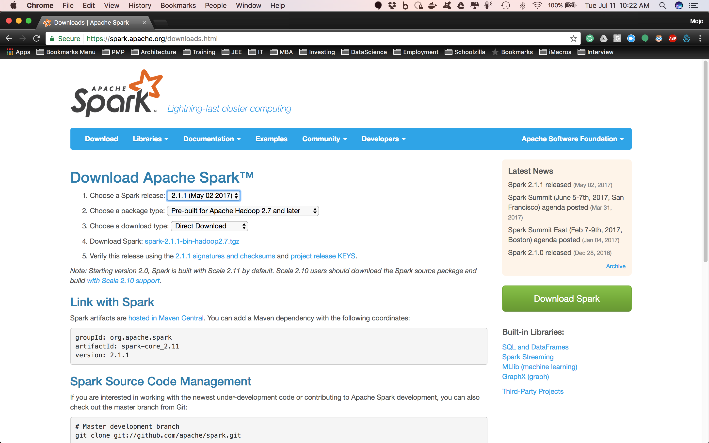
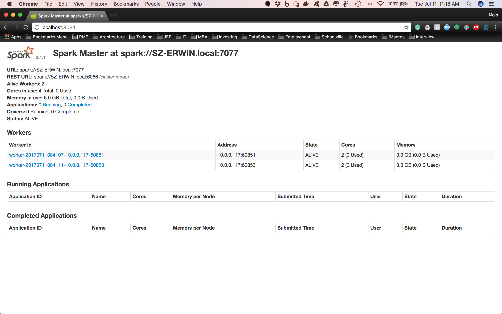

# College App Tracker ETL
## Introduction
This repo contains the project that will extract, transform and load college data from the Department of Education (DOE) Integrated Postsecondary Education Data System (IPEDS).  It utilizes Apache Spark and Spark SQL to extract and transform the data.  The load process will load the transformed data into a PostgreSQL database.

## To get started:

### Install and Set up Apache Spark cluster

1. Download[ Apache Spark](http://spark.apache.org/downloads.html).  

    1.1. Release - 2.1.1- (May 02, 2017).  

    1.2. Package type - Pre-built for Hadoop 2.7 and later

2. Unpack spark-2.1.1-bin-hadoop2.7.tgz file.  In my machine, I have it unpacked in /Users/erwin/local directory.

3. Update your .bash_profile file.  This file is a hidden file located in your home directory (mine is in /Users/erwin).

    3.1. Open a terminal session

    3.2. Go to your home directory.

    3.3. Update your bash profile using your favorite editor.  Your bash profile is in a file called .bash_profile.  This is a hidden file.  If you do an ```ls -al``` in a command prompt in your terminal it will list all the files including the hidden files.

    3.4. In the .bash_profile file, update the PATH setting.  It should look like this.

        export PATH=$PATH:/usr/local/sbin:/Users/erwin/spark-2.1.1-bin-hadoop2.7/bin:/Users/erwin/spark-2.1.1-bin-hadoop2.7/sbin

4. Go to your Apache Spark installation.

    4.1. Go to the conf directory

    4.2. Copy the spark-env.sh.template file and rename your copy "spark-env.sh." Edit the spark-env.sh file

    4.3. Add the following line

        export SPARK_WORKER_INSTANCES=2

        export SPARK_WORKER_MEMORY=3g

        export SPARK_WORKER_CORES=2

5. Start Apache Spark

    5.1. Start the master

        $ start-master.sh

    5.2. Go to the[Apache Spark Console](http://localhost:8081/).

    5.3. Start the workers

        $ start-slave.sh "spark url"

        $ start-slave.sh spark://10.0.0.117:7077

6. You should see something like that in your Apache Spark Console.  Those numbers should match what you defined in spark-env.sh

7. To stop spark

    7.1. prompt> stop-master.sh

    7.2. prompt> stop-slave.sh

## Submit Spark Job

Since we are using Groovy (Java) to perform Spark ETL process against IPEDS files, we need to jar our application before we can submit it in our Spark cluster.

##### Build and create the jar file
```
$ gradle build jar
```

##### Submit the Apache Spark Job
```
$ spark-submit --class com.erwindev.college.CollegeETL --master local[8] build/libs/college-app-tracker-etl-1.0.jar
```
